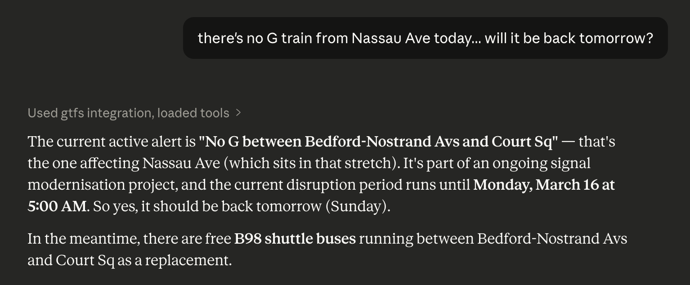
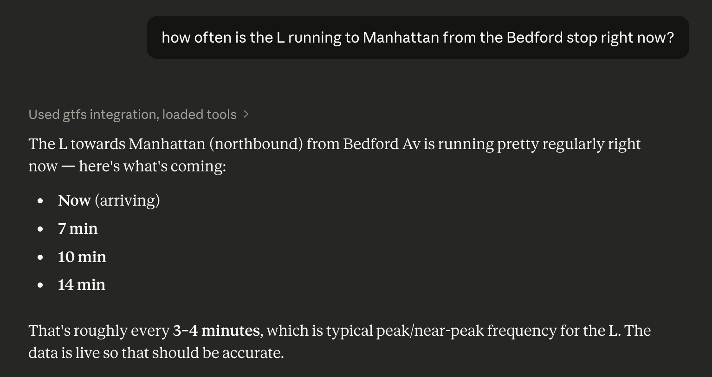

# GTFS MCP

This is an MCP server for querying public transit info from GTFS schedules and GTFS-RT realtime feeds. It works with any GTFS-compatible transit system, and includes a ready-to-use config for NYC Subway (MTA).

Ask things like *"When's the next L from Bedford Av?"*, *"Any service alerts on the G?"*, or *"What stops does the 7 train serve?"*.

**Service alerts example**




**Arrivals example**



## Quickstart

Requires Node 22+.

```bash
git clone https://github.com/jdamcd/gtfs-mcp.git && cd gtfs-mcp
npm install
npm run build
```

Add to your Claude Desktop config (`claude_desktop_config.json`):

```json
{
  "mcpServers": {
    "gtfs": {
      "command": "node",
      "args": ["/absolute/path/to/gtfs-mcp/dist/index.js"],
      "env": {
        "GTFS_MCP_CONFIG": "/absolute/path/to/gtfs-mcp/config.mta.json"
      }
    }
  }
}
```

Restart Claude Desktop and ask an NYC transit question. The first query triggers a GTFS schedule download (~30s for MTA). Subsequent queries are fast.

### Adding other transit systems

The server reads a JSON config defining one or more transit systems, pointed to by `GTFS_MCP_CONFIG`. Find feeds for your local agency in the [Mobility Database](https://mobilitydatabase.org/).

```json
{
  "systems": [
    {
      "id": "mbta",
      "name": "MBTA Boston",
      "schedule_url": "https://cdn.mbta.com/MBTA_GTFS.zip",
      "timezone": "America/New_York",
      "realtime": {
        "trip_updates": ["https://cdn.mbta.com/realtime/TripUpdates.pb"],
        "vehicle_positions": ["https://cdn.mbta.com/realtime/VehiclePositions.pb"],
        "alerts": ["https://cdn.mbta.com/realtime/Alerts.pb"]
      },
      "auth": null
    }
  ],
  "data_dir": "~/.gtfs-mcp/data",
  "schedule_refresh_hours": 24
}
```

Each realtime feed type accepts multiple URLs (e.g. MTA splits trip updates across 8 feeds). Set any feed type to `[]` if the system doesn't provide it.

`timezone` is the agency's IANA timezone (e.g. `"Europe/London"`). It's used to compare scheduled stop times to "now" and render times in responses regardless of server timezone.

### Authenticated feeds

Some transit APIs require an API key. Keys are read from environment variables at runtime. Set them in the Claude Desktop `env` block alongside `GTFS_MCP_CONFIG`.

**Query parameter**:
```json
{
  "auth": {
    "type": "query_param",
    "param_name": "api_key",
    "key_env": "MY_API_KEY"
  }
}
```

**Header:**
```json
{
  "auth": {
    "type": "header",
    "header_name": "X-Api-Key",
    "key_env": "MY_API_KEY"
  }
}
```

Set `auth` to `null` for systems that don't require authentication.

## Tools

| Tool | Description | Parameters |
|------|-------------|------------|
| `list_systems` | List all configured transit systems | — |
| `search_stops` | Search stops by name | `system`, `query`, `limit?` |
| `find_nearby_stops` | Stops near a coordinate, ordered by distance | `system`, `lat`, `lon`, `radius_m?`, `limit?` |
| `get_stop` | Stop details and routes serving it | `system`, `stop_id` |
| `get_arrivals` | Upcoming arrivals with realtime delays | `system`, `stop_id`, `route_id?`, `limit?` |
| `list_routes` | Routes in a system, with optional name filter and pagination | `system`, `query?`, `route_type?`, `limit?`, `offset?` |
| `get_route` | Route details with ordered stop list | `system`, `route_id`, `direction_id?` |
| `get_alerts` | Active service alerts | `system`, `route_id?`, `stop_id?` |
| `get_vehicles` | Live vehicle positions | `system`, `route_id?` |
| `get_trip` | Trip stop sequence with realtime delays | `system`, `trip_id` |
| `get_system_status` | System overview: counts, alerts, feed health | `system` |

The `system` parameter is the system ID from your config (e.g. `"mta-subway"`). IDs flow between tools — e.g. `search_stops` returns a `stop_id` that `get_arrivals` consumes.

## Development

```bash
npm test               # vitest run
npm run test:watch     # watch mode
```

### Evals

LLM evals use [promptfoo](https://promptfoo.dev/) to verify that a model selects the correct tools for natural-language transit queries. Requires `ANTHROPIC_API_KEY` set in `.env` or the environment.

```bash
npm run build
npm run eval
npm run eval:view   # web UI to inspect results
```

### MCP inspector

Test tools interactively without a Claude client:

```bash
GTFS_MCP_CONFIG=./config.mta.json npx @modelcontextprotocol/inspector node dist/index.js
```
